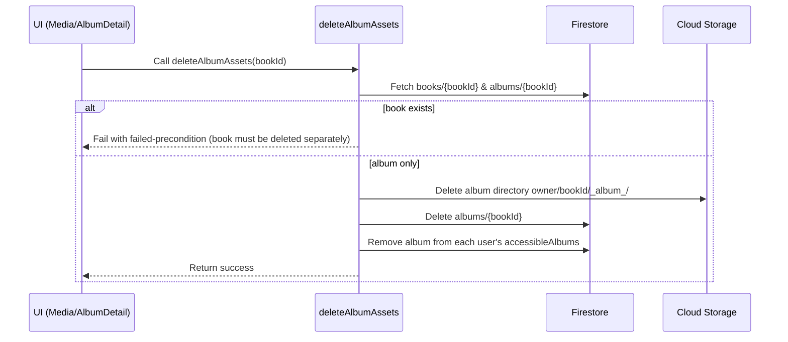

# Album and Book Deletion Flow

## Overview
When an album is created alongside a book, both share the same ID. Calling the `deleteAlbumAssets` HTTPS callable now blocks deletion whenever the book document still exists. This prevents accidental removal of book data; callers must delete the book through its dedicated flow first or remove individual media instead.

## Key Components
- **Frontend callers**: `src/pages/Media.jsx` and `src/pages/AlbumDetail.jsx` invoke the `deleteAlbumAssets` callable when a user deletes an album.
- **Callable**: `functions/deleteMedia.js#deleteAlbumAssets` handles storage cleanup and album document removal only when no book document exists for the ID.
- **Storage trigger**: `functions/mediaProcessor.js#onMediaDelete` updates album documents and usage when individual files are deleted.

## Sequence: Attempted Album Deletion While Book Exists (blocked)

## Recommended Usage
- **Delete book-backed albums**: Delete the book through the book deletion flow; the album will be cleaned up as part of that process. Direct album deletion is blocked while the book exists.
- **Delete orphaned albums**: If the book document is already absent, call `deleteAlbumAssets` to remove the remaining album data and storage.
- **Delete single media item**: Use `deleteMediaAsset`; `onMediaDelete` will adjust album metadata and storage usage.
